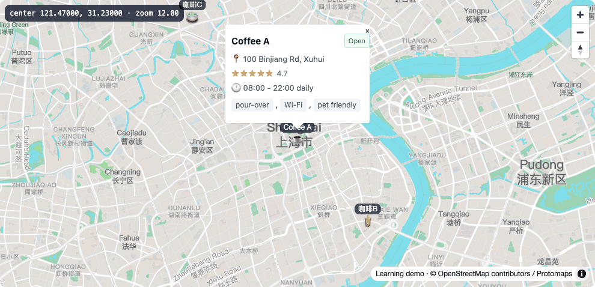
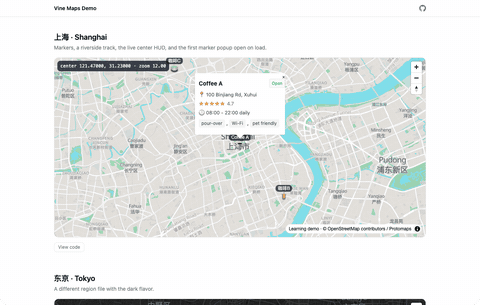

# Vine 🌿

**Fully static maps, zero backend.** A reusable **MapView component** (React +
plain-HTML widget), a **pmtiles region management CLI**, a demo site and a
component playground. Everything is built statically and can be served from
any static host, S3, or R2.

<p align="center">
  <a href="https://xiongjia.github.io/vine/">
    
  </a>
</p>

<p align="center">
  <a href="https://xiongjia.github.io/vine/">
    
  </a>
</p>

<p align="center">
  <a href="https://xiongjia.github.io/vine/">
    <b>Try the live demo →</b>
  </a>
</p>

**React** · **Plain-HTML widget** · **PMTiles** · **Zero backend**

## Why Vine

- **Self-hosted tiles** — your own pmtiles region files, no vendor token or
  usage limits.
- **Fully static** — no server, deploy to GitHub Pages / R2 / any CDN.
- **Zero-build embedding** — a self-contained widget you drop into plain HTML.
- **Offline-capable** — local tile cache for development.

## Quick Start

Choose the path that fits you:

**A. See it live (zero setup)**
Just open the [demo site](https://xiongjia.github.io/vine/) — or download the
[widget example](https://xiongjia.github.io/vine/examples/embed.html) and open
it locally (requires network access for tiles and CDN deps). No install, no
build.

**B. Run the demo locally (development)**

```bash
pnpm install
pnpm exec turbo run dev --filter=@vine/demo     # demo → http://localhost:5173/vine/
pnpm exec turbo run dev --filter=@vine/playground   # component playground
```

One-off local tile cache (needs the `pmtiles` binary):

```bash
pnpm --filter=@vine/maps-cli cli extract shanghai
```

**C. Use it in your project**

`@vine/ui` is consumed as a workspace package for now (npm publishing is
planned). Inside the monorepo, import `MapView` from `@vine/ui`:

```tsx
import { MapView, shanghaiMarkers } from "@vine/ui";

const Demo = () => (
  <MapView
    basemap={{ url: "pmtiles:///pmtiles/shanghai.pmtiles", flavor: "light" }}
    center={[121.47, 31.23]}
    zoom={12}
    markers={shanghaiMarkers}
    showCenterHud
    className="h-[480px] w-full"
  />
);
```

Region files are plain `.pmtiles` archives you host yourself — extract and
publish them with `maps-cli` (see [docs/pmtiles.md](docs/pmtiles.md)) or serve
them from any static host / S3 / R2. Point `basemap.url` at your own file
(`pmtiles:///relative/path` for same-origin files, `pmtiles://https://…` for
remote object storage).

Other useful commands:

```bash
pnpm exec turbo run build:widget --filter=@vine/ui   # widget bundle → packages/ui/dist/widget/
pnpm exec turbo run build
pnpm exec turbo run test
```

## MapView API at a glance

| Prop                                       | Type                                          | Description                                      |
| ------------------------------------------ | --------------------------------------------- | ------------------------------------------------ |
| `basemap.url`                              | `string`                                      | `pmtiles://` URL of the region file (required)   |
| `basemap.flavor`                           | `"light" \| "dark" \| "grayscale" \| "black"` | Protomaps flavor                                 |
| `basemap.lang` / `glyphs` / `attribution`  | `string`                                      | Label language, glyphs URL template, attribution |
| `center` / `zoom`                          | `[lng, lat]` / `number`                       | Initial camera                                   |
| `markers`                                  | `MarkerSpec[]`                                | Point markers with labels, emoji, popups         |
| `tracks`                                   | `TrackSpec[]`                                 | Line / polygon annotations                       |
| `openMarkerIndex`                          | `number`                                      | Auto-open one popup on first render              |
| `showCenterHud`                            | `boolean`                                     | Live center / zoom HUD overlay                   |
| `navControl`                               | `boolean`                                     | Zoom / compass controls (default `true`)         |
| `onMapReady`                               | `(map: Map) => void`                          | Called once the style has loaded                 |
| `onClick` / `onMove` / `onZoom` / `onIdle` | `(e) => void`                                 | MapLibre event bridge                            |

See **[docs/mapview.md](docs/mapview.md)** for the full React & widget APIs.

## Repo Layout

```
vine/
├── apps/demo/            # MapView showcase (GitHub Pages entry)
├── apps/playground/      # UI component docs sandbox
├── apps/maps-cli/        # pmtiles extract & R2/S3 upload CLI
├── packages/ui/          # shadcn/ui components + MapView + vite plugins
├── packages/config/      # Shared TypeScript & ESLint config
├── .maps-cache/          # Local pmtiles + glyphs cache (gitignored)
└── docs/                 # Architecture / MapView / pmtiles / publishing
```

## Documentation

- **[docs/architecture.md](docs/architecture.md)** — monorepo layout, apps,
  component library, map stack, CI
- **[docs/mapview.md](docs/mapview.md)** — MapView component design, React &
  widget APIs, compatibility notes
- **[docs/pmtiles.md](docs/pmtiles.md)** — region tile management with
  `maps-cli`, region presets, metadata sidecar, local cache
- **[docs/distribution.md](docs/distribution.md)** — distributing via S3-compatible
  storage (R2/S3) or static widget files: bucket config, sync-assets, build-time URLs
- **[docs/ci.md](docs/ci.md)** — CI pipeline and GitHub Pages deployment, including
  the required repo-level Actions variables for the R2 tile/glyph URLs

## License

MIT

## Acknowledgements

Map data © [OpenStreetMap](https://www.openstreetmap.org/copyright)
contributors, basemaps by [Protomaps](https://protomaps.com/), maps rendered
with [MapLibre GL](https://maplibre.org/).
